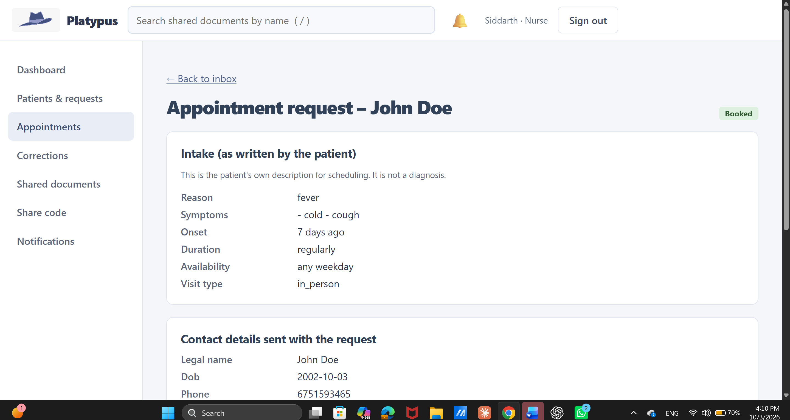
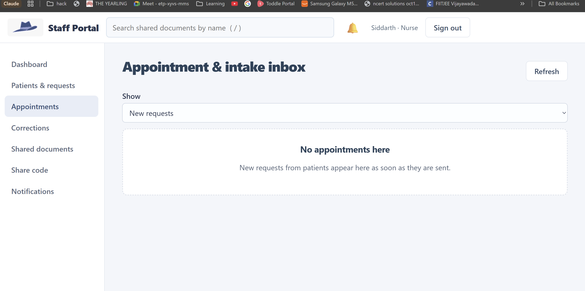

# Platypus

**[Download everything: apps, database, source and setup](https://github.com/Shiva2966/platypus-health-portal/releases/download/hackathon-2026-10-03/Platypus-complete-submission.zip)**

## Judge quick start
1. Download and extract the complete ZIP; install Python 3.11 or newer.
2. Run START-DEMO.ps1 in PowerShell; it installs requirements and opens the bundled fictional database without resetting it.
3. Open http://127.0.0.1:8000/ for patients or http://127.0.0.1:8000/staff/ for staff.
4. Use the existing presentation credentials. For the public fresh-seed credentials below, follow Run from source in a fresh checkout instead.

Fresh-seed patient: jordan.ellis@example.test / Demo-Patient-2026!
Fresh-seed nurse: nurse@riverside.demo / Staff-Demo-2026!
These credentials belong to the freshly seeded dataset; existing presentation account passwords are preserved in the bundled database. Local development skips login OTP.

## Demo availability
The downloadable package runs independently of the original laptop. Native apps require a running backend and its address in their Server Settings. No temporary tunnel address is promised as permanent.
For always-on public access, deploy the backend and persistent database to an always-on host with a fixed HTTPS address; see backend/DEPLOY.md. A laptop tunnel stops serving during sleep, power loss or internet loss. Its watchdog can restart failed processes, but a restarted quick tunnel may receive a new address.


Patient-controlled health portal with a FastAPI backend, patient web app,
hospital staff web app, Android patient client and Windows hospital client.

## Submission contents
- `backend/`: source, requirements, tests, migrations and deployment documentation.
- `clients/`: Android and Windows client source and build instructions.
- The separate **Platypus-complete-submission.zip** contains the Android APK,
  Windows applications, full fictional demo database, and START-DEMO.ps1.
  Download the complete bundle from [the submission release](https://github.com/Shiva2966/platypus-health-portal/releases/tag/hackathon-2026-10-03).

## Run from source
Use Python 3.11 or newer. From `backend/`:
```powershell
python -m venv .venv
.\.venv\Scripts\python.exe -m pip install -r requirements.txt
$env:APP_ENV = "development"
$env:MAIL_DISABLED = "1"
$env:LOGIN_OTP_REQUIRED = "0"
.\.venv\Scripts\python.exe seed.py --demo
.\.venv\Scripts\python.exe -m uvicorn app.main:app --host 127.0.0.1 --port 8000
```
Run these commands in a fresh checkout: `seed.py --demo` resets its target database.
Patient: http://127.0.0.1:8000/ ; hospital: http://127.0.0.1:8000/staff/
The seed command prints the newly created demo account credentials.
For the existing presentation dataset, use START-DEMO.ps1 in the complete bundle instead.
See `backend/DEPLOY.md` for production hosting and `clients/README.md` for native builds.
Native clients require a running backend. Temporary Cloudflare links can change.

## Demo data notice
All included identities and medical data are fictional, as confirmed by the project owner.
They do not represent real patients. Open-source provenance has not been independently
verified for every sample; externally sourced materials require their original attribution.
Secrets and current session/database data are excluded from this Git repository.
The separate database download is for demonstrations only.

## Presentation screenshots
Screenshots supplied during the demonstration; account names and records are fictional.




